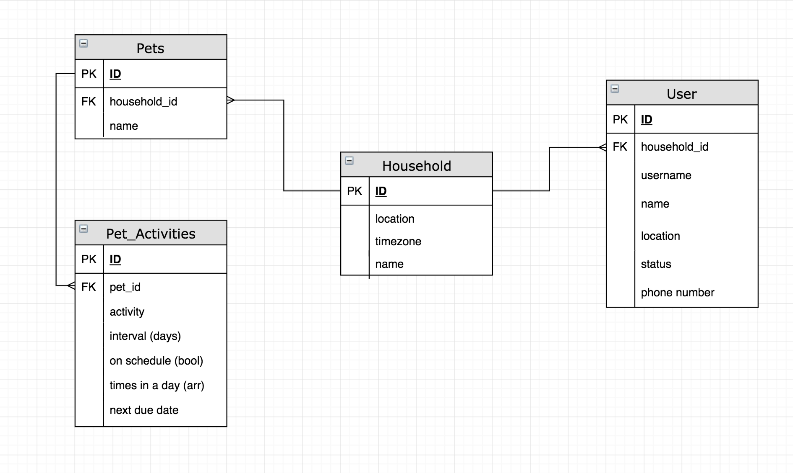

# PetStat

A household with multiple people and pets can be a bit disorganized. This app was created to facilitate the care of pets by allowing the pet owners to see their pet's status.

## Frontend
[https://github.com/CIMontoya/PetStat](https://github.com/CIMontoya/PetStat)

## Entity Relationship Diagram

## Server Routes

- Get request to access all the data of a household specified by the user
    ('/:household')
- Get request to access all of the users in the app
    ('users')
- Post request to add a user to the user table
    ('/user')
- Post request to add a pet to the pets table
    ('/pet')
- Post request to add an activity to the activity table
    ('/activity')
- Update request in case of owner info change
    ('/userData/:id')
- Update request in case of pet info change
    ('/petData/:id')
- Update request in case of household info change
    ('/houseData/:id')
- Delete request for caretakers not being further available
    ('/user/:id')
- Delete request for pets that are no longer in the household
    ('/pet/:id')
- Delete request for activities that are no longer required
    ('activity/:id')

## Technologies

## User Stories

- As a user, I would like to create a house so I can contain all the pets and caretaker info

- As a user, I would like to add caretakers to the house so they can update the pet's needs

- As a user, I would like to add pets to the house so I know what pets live in the house

- As a user, I would like to add activities for each individual pet so that each pet gets it's own personal care

- As a user, I would like to remove pets, caretakers, households, or activities when they are no longer required

- As a user, I would like to edit pet, caretaker, household, or activity information in case a change has been made

- As a user, I would like to receive a notification when an activity need to be completed so that I am reminded to do the activity

- As a user, I would like to see a household and everything pertaining to it so I can see how my pets are doing and when the next activity will take place

- As a user, I would like to sign up or log in so I have a personalized experience in the app

- As a user, I would like to log out so my data is safe if I lose my phone

## Trello Board

[Trello](https://trello.com/b/6uBnQbyQ/petstat)
